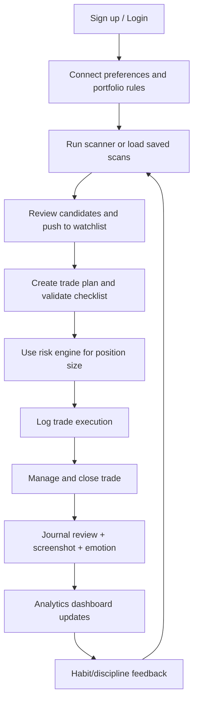
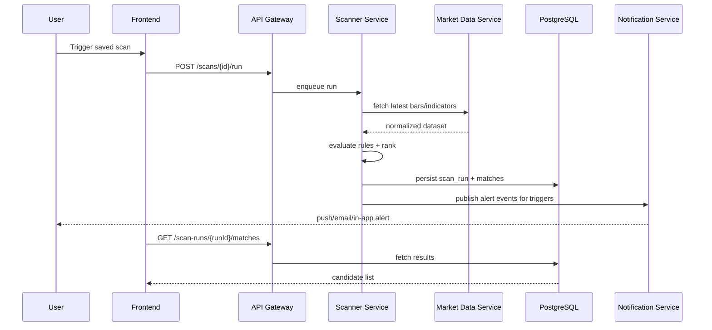
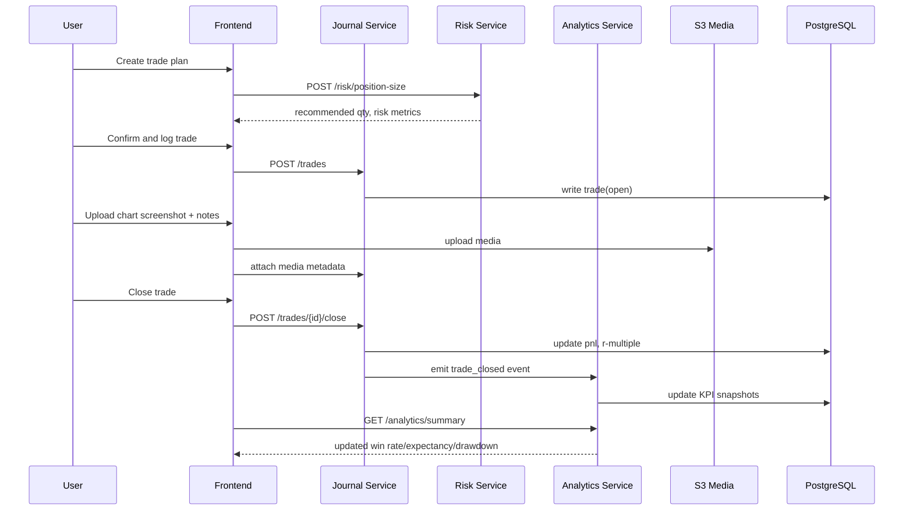

# User and system flows

## 1. End-to-end user lifecycle

## 2. Scanner execution flow

## 3. Trade journaling + analytics flow

## 4. Information architecture
- Workspace
  - Scanner
  - Watchlists
  - Chart + Planner
  - Journal
  - Analytics
  - Learning Lab
- Global entities
  - Symbol
  - Trade Plan
  - Trade
  - Alert
  - Strategy Template
